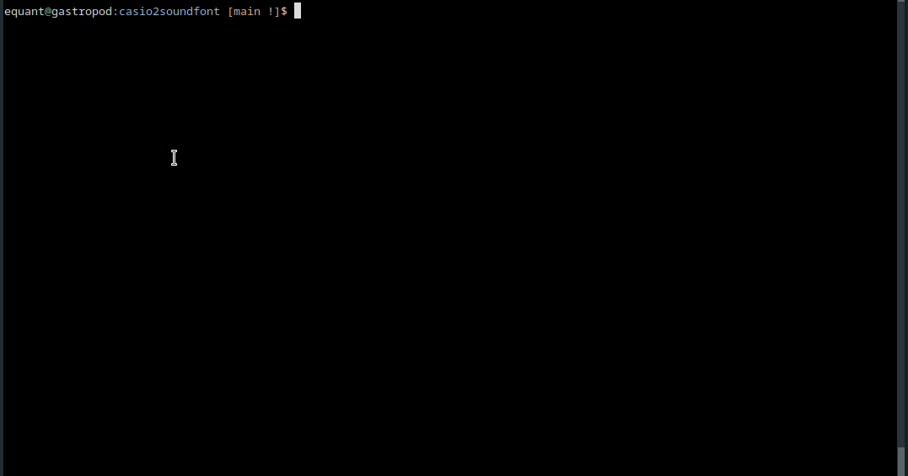

# casio2soundfont

## `record.py`
- Helps streamline/automate the recording of samples from keyboards without midi.  Saves samples as wav files.
- Normalizes all samples against all samples.  Each sample will be made louder if possible, but if the real keyboard goes loud -> quiet as you go up in pitch, that will be preserved.
- Detects loop points and saves them to a text file.

